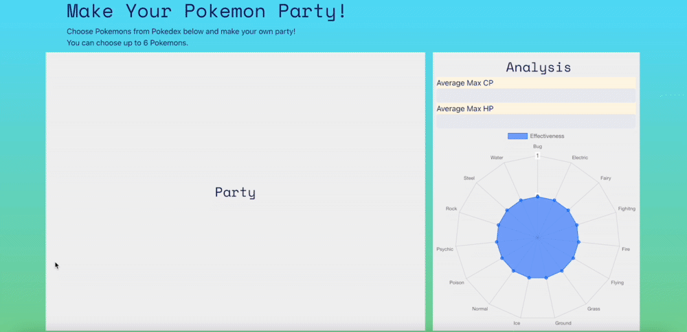

# Poke-Party

## Introduction
This is an application that you can create your pokemon party and see analysis of it. `allPokemon.js` file was provided by Code Chrysalis and it contains information of 50 pokemons. Users can choose up to 6 pokemons and add them to your party. As users do that, JavaScript calculates your party's average Max CP and average Max HP, then `reactstrap` displays them in bars. Also, `chart.js` displays your party's resistant and weakness in radar chart.

Through making this app, I practiced:

- React
- HTML/CSS/JavaScript
- Bootstrap
- chart.js

## Requirements
- node v16.6.1+
- npm 7.20.3+

## Installation

Make sure to run `npm install` first.

## Usage

Please refer to [README_React.md](README_react.md).